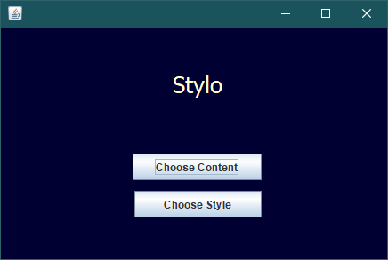
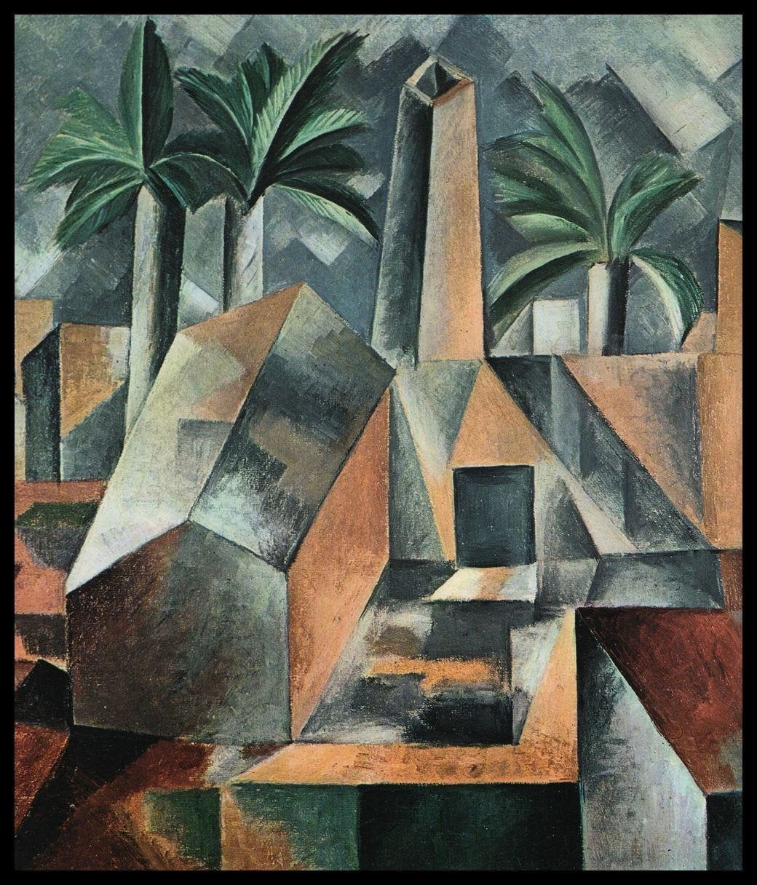
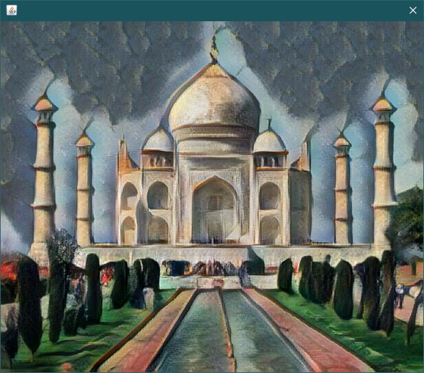

# Stylo
 

A Java GUI app made using Swing that implements Neural Style Transfer.

It also uses the DeepAI Fast Style Transfer API for style transfer.

Read more about DeepAI API <a href="https://deepai.org/machine-learning-model/fast-style-transfer" target="_blank">here.</a>

### Dependencies
<ul>
  <li>DeepAI account for API key</li>
  <li>Java JDK 11.0.3</li>
</ul>

### Download 

Download the JAR file for Windows, Linux and macOS <a href="https://github.com/atharva-18/Stylo/releases/download/1.0/Stylo.jar" target="_blank">here</a>

### Usage 

Run the following commands to create the executable JAR file

```
$ javac mainActivity.java
$ jar cfe Stylo.jar mainActivity *.class api.py
```
Make sure that you include the external JAR files before compiling your application.

### Screenshots<br>

<b>Main Screen</b>


<br>

<b>Content Image</b>


<b>Style Image</b>



<b>Output Screen</b>



### Contributors

1. <a href="https://github.com/atharva-18" target="_blank">atharva18</a>
